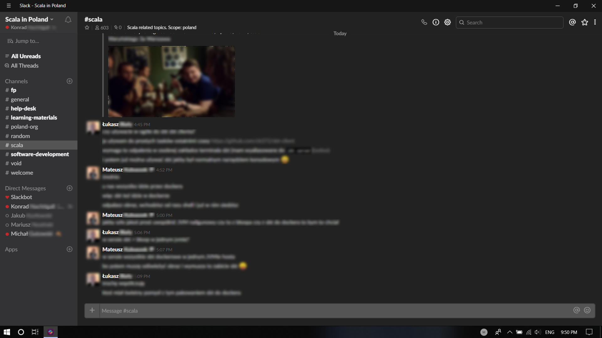

# Slack-Black

## What is this?

>This is the script to make Slack Desktop App (on Windows) night-mode (or to customize it in a way you'd like to).

## How to install this

1. Download the 'Slack-Black.ps1' file
2. Run this using Windows Powershell
3. Restart the Slack app
4. You're done!

## Can I customize this? 

Yes, sure, you can, to do this, do:

1. Fork the repo
2. Add changes in index.css as you'd like to see in your Slack
3. In Slack-Black.ps1 file change link to the .css file to your one. (To get raw link as mine, click on index.css on GitHub using browser, then click `RAW` and copy-paste the link to the Slack-Black.ps1 file)
4. Save your edition in Slack-Black.ps1 file also in the .ps1 extension (That's for Powershell)
5. Just run the script and restart your Slack app, you're done!